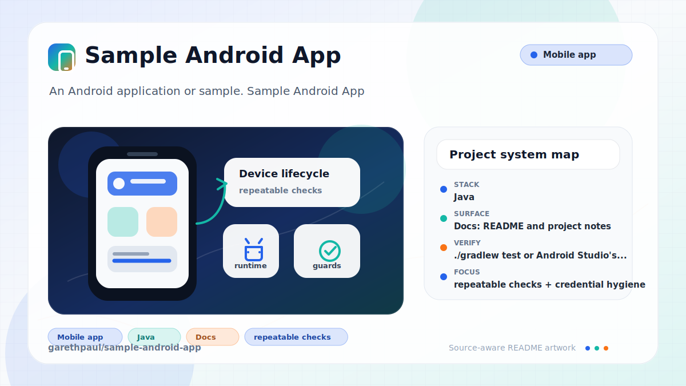

# sample-android-app

<!-- README-OVERVIEW-IMAGE -->


## Overview

`garethpaul/sample-android-app` is an Android application or sample. Sample Android App

This README is based on the checked-in source, manifests, scripts, and repository metadata on the `master` branch. The project language mix found during review was: Java (11).

## Repository Contents

- `README.md` - project overview and local usage notes
- `CHANGES.md` - maintenance history for Android contract checks
- `Makefile` - local verification entry points
- `build.gradle` - Android or Gradle build configuration
- `app` - source or example code
- `docs` - source or example code
- `docs/plans` - completed maintenance plans for the current baseline
- `gradle` - source or example code
- `gradlew` - Android or Gradle build configuration
- `plans` - historical implementation notes
- `scripts` - static Android contract validators
- `SECURITY.md` - security reporting and disclosure guidance
- `VISION.md` - project direction and maintenance guardrails

Additional scan context:

- Source directories: app, docs, gradle
- Dependency and build manifests: build.gradle, gradlew
- Entry points or build surfaces: Gradle build files
- Test-looking files: no obvious test files detected

## Getting Started

### Prerequisites

- Git
- Android Studio or a compatible Android SDK
- Gradle or the checked-in Gradle wrapper when present

### Setup

```bash
git clone https://github.com/garethpaul/sample-android-app.git
cd sample-android-app
cp app/src/main/java/com/example/app/Const.java.example app/src/main/java/com/example/app/Const.java
```

The setup commands above are derived from repository files. Legacy mobile, Python, or JavaScript samples may require older SDKs or package versions than a modern workstation uses by default.

Fill the copied `Const.java` with local Twitter OAuth and ad-network values.
The real file is ignored by git; keep the checked-in `.example` file free of
secrets.

## Running or Using the Project

- Use Android Studio to open the project or run `./gradlew assembleDebug` when the Android SDK is configured.

## Testing and Verification

- `./gradlew test` or Android Studio's test runner when the SDK is configured
- `make check` runs static checks for wrapper safety, ignored build outputs,
  local credential templates, hardcoded ad-unit values, and observable
  stream-copy error handling.
- `make check` also requires app backup to stay disabled in the manifest. Set
  `RUN_LEGACY_GRADLE=1` to attempt the legacy Gradle build on a compatible
  Android SDK.
- `make check` also verifies that only `MainActivity` exposes the launcher and
  `oauth://t4jsample` callback entry points.
- `make check` also verifies that manifest exported state is explicit for
  `MainActivity` and `HomeActivity`.
- `make check` also verifies that the manifest requests only network access and
  that image cache data stays in app-internal cache storage.
- `make check` also verifies image-load failures are logged through Android's
  logger and failed decodes are guarded before rounded bitmap rendering.
- `make check` also verifies image cache writes report completion and partial
  cache files are deleted after failed copies.
- `make check` also verifies download exceptions and invalid downloaded image
  payloads do not leave unusable cache files behind.
- `make check` also verifies cached image decode streams are closed and decode
  failures are logged.
- `make check` also verifies null or empty image URLs show the placeholder
  without queueing cache work.
- `make check` also verifies profile image downloads log failures, guard failed
  decodes, and show the placeholder image on failure.
- `make check` also rejects sensitive Logcat output containing OAuth preference
  maps, profile values, timelines, or rendered tweet collections.
- `make check` also rejects caught exception messages, throwable payloads, and
  stack traces while preserving fixed tagged failure events.
- `make check` also requires OAuth tokens to stay only in private auth
  preferences and logout to clear both auth and profile preferences before
  returning to the login screen.
- `make check` also requires the login flow to correlate OAuth callback request
  tokens with the active request token, exact callback authority and path, and
  a nonempty verifier before access-token exchange, then consume each accepted
  request token once and clear stale request tokens before retry.
- OAuth completion requires both profile and auth preference commits before
  authenticated navigation and purges both stores after persistence failure.
- Authenticated entry requires the stored login flag plus a nonempty OAuth
  token and secret; incomplete Home sessions redirect before network work.
- Successful logout must remove the authenticated Home activity from the back stack
  after credentials are cleared and login navigation starts.
- Home teardown and successful logout invalidate pending timeline publications;
  teardown also destroys the initialized ad view.
- Home teardown and successful logout invalidate pending profile image publications,
  cancel the active task, and reject stale UI completion. Profile image HTTP
  work uses finite connect/read timeouts and disconnects after stream cleanup.
- Twitter profile and timeline images use HTTPS-only transport, including the
  vendored Twitter4J HTTPS URL accessors and a shared non-HTTPS rejection guard.
- `make check` also verifies local IDE metadata stays ignored and untracked.
- `make root-test` proves every public Make target keeps its repository root,
  shell, shell flags, and Ruby checker under repository control while rejecting
  preload and file-list overrides and treating Gradle configuration as data.
- The static checker also requires completed canonical plans under `docs/plans`.
- GitHub Actions installs Ruby 3.3 and runs `make check` with pinned actions,
  read-only permissions, credential-free checkout, every-branch coverage, and
  a bounded timeout.
- `app/libs/SHA256SUMS` records and verifies every vendored advertising and
  social SDK JAR without attempting to revive the archival Android build.

When the required SDK or runtime is unavailable, use static checks and source review first, then verify on a machine that has the matching platform toolchain.

## Configuration and Secrets

- Detected references to Twitter. Keep API keys, OAuth credentials, tokens, and account-specific values in local configuration only.

## Security and Privacy Notes

- Review changes touching authentication or token handling; examples from the scan include app/src/main/AndroidManifest.xml, app/src/main/java/com/example/app/Const.java.example, app/src/main/java/com/example/app/HomeActivity.java, app/src/main/java/com/example/app/MainActivity.java, and 1 more.
- Review changes touching external API calls or credential-adjacent configuration; examples from the scan include app/src/main/java/com/example/app/HomeActivity.java, app/src/main/java/com/example/app/MainActivity.java, app/src/main/res/layout/activity_main.xml.
- Review changes touching network requests, sockets, or service endpoints; examples from the scan include app/proguard-rules.txt, app/src/main/AndroidManifest.xml, app/src/main/java/com/example/app/MainActivity.java, app/src/main/res/drawable-hdpi/border.xml, and 6 more.
- Review changes touching mobile permissions or privacy-sensitive device data; examples from the scan include app/src/main/AndroidManifest.xml, gradlew.
- Review changes touching file, media, JSON, XML, CSV, OCR, or data parsing; examples from the scan include app/src/main/AndroidManifest.xml, app/src/main/java/com/example/app/HomeActivity.java, app/src/main/java/com/example/app/ImageLoader.java, app/src/main/java/com/example/app/MainActivity.java, and 6 more.

## Maintenance Notes

- This looks like a legacy Android project or sample. Expect Android SDK, Gradle, and support-library versions to matter.
- See `SECURITY.md` for vulnerability reporting and safe research guidance.
- See `VISION.md` for project direction and contribution guardrails.
- See `docs/plans/2026-06-08-sample-android-app-baseline.md` for the canonical
  Android sample contract baseline.
- See `docs/plans/2026-06-08-disable-app-backup.md` for the manifest backup
  privacy guard.
- See `docs/plans/2026-06-08-manifest-entrypoints.md` for the launcher and
  OAuth callback exposure guard.
- See `docs/plans/2026-06-09-internal-image-cache.md` for the storage and
  location permission minimization guard.
- See `docs/plans/2026-06-09-image-loader-failure-handling.md` for the
  ImageLoader failure handling guard.
- See `docs/plans/2026-06-09-image-cache-write-result.md` for the image cache
  write-result and partial-file cleanup guard.
- See `docs/plans/2026-06-09-image-cache-decode-cleanup.md` for the cached
  image decode stream cleanup guard.
- See `docs/plans/2026-06-09-empty-image-url-guard.md` for the empty image URL
  placeholder guard.
- See `docs/plans/2026-06-09-profile-image-failure-guard.md` for the profile
  image failure handling guard.
- See `docs/plans/2026-06-09-ide-metadata-ignore.md` for local IDE metadata
  ignore coverage.
- See `docs/plans/2026-06-09-manifest-exported-state.md` for explicit
  activity exported-state coverage.
- See `docs/plans/2026-06-10-ci-baseline.md` for the hosted GitHub Actions
  baseline.
- See `docs/plans/2026-06-10-vendored-sdk-integrity.md` for the vendored JAR
  integrity boundary.
- See `docs/plans/2026-06-10-image-cache-failure-cleanup.md` for transport and
  decode failure cache cleanup.
- See `docs/plans/2026-06-12-sensitive-log-redaction.md` for the credential and
  user-content logging boundary.
- See `docs/plans/2026-06-12-exception-log-redaction.md` for the exception detail
  and stack-trace logging boundary.
- See `docs/plans/2026-06-13-logout-credential-purge.md` for the dedicated OAuth
  storage and logout credential-purge contract.
- See `docs/plans/2026-06-13-oauth-callback-correlation.md` for exact-origin and
  request-token callback correlation before exchange.
- See `docs/plans/2026-06-14-make-root-override-protection.md` for the
  caller-resistant, location-independent Android validation root.
- See `docs/plans/2026-06-21-make-authority-isolation.md` for isolated Make
  authority and hostile-input regression coverage.
- See `docs/plans/2026-06-14-oauth-callback-address-integrity.md` for exact
  callback authority and path validation before token exchange.
- See `docs/plans/2026-06-14-oauth-request-token-consumption.md` for one-shot
  request-token consumption before access-token exchange.
- See `docs/plans/2026-06-15-oauth-request-token-retry-reset.md` for fail-closed
  OAuth retries that discard stale in-memory request tokens.
- See `docs/plans/2026-06-16-oauth-session-persistence.md` for fail-closed
  profile and OAuth credential persistence before authenticated navigation.
- See `docs/plans/2026-06-16-oauth-session-integrity.md` for complete persisted
  OAuth credential checks at both authenticated entry points.
- See `docs/plans/2026-06-17-logout-back-stack-revocation.md` for revoking the
  authenticated Home activity after successful logout.
- See `docs/plans/2026-06-25-home-timeline-lifecycle.md` for timeline
  invalidation and Home ad teardown.
- See `docs/plans/2026-06-25-profile-image-lifecycle.md` for profile image
  publication invalidation, cancellation, and bounded connection ownership.
- See `docs/plans/2026-06-26-https-image-transport.md` for the shared image URL
  policy and Twitter4J HTTPS accessor migration.

## Contributing

Keep changes small and tied to the project that is already present in this repository. For code changes, document the toolchain used, avoid committing generated dependency directories or local configuration, and update this README when setup or verification steps change.
